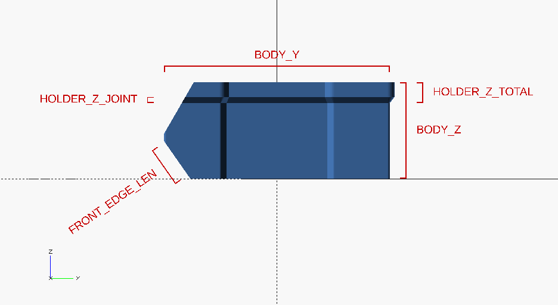

# Parametric Stackable Box

<p align="center">
  
</p>

The design is a blatant rip-off of the famous [Stackable Box](https://www.thingiverse.com/thing:647425).

Pros:
- It's parametric! (written in OpenSCAD)
- Ticker 1.6 mm wall to improve stackability.

Cons:
- No fancy variants/accessories. ([WIP](#VariantsAccessories))


## Dependencies
- [OskarLinde]'s [scad-utils](https://github.com/OskarLinde/scad-utils)
  - Install dependencies to your OpenSCAD libraries dir.
```sh
$ cd ~/.local/share/OpenSCAD/libraries
$ git clone https://github.com/OskarLinde/scad-utils
```
- openscad-nightly (`20181009T230242.gitf3de0e27+2416.1`)

## Build
```sh
$ git clone https://github.com/likeablob/parametric-stackable-box
$ cd parametric-stackable-box
$ make -j4
```

## Parameters
<p align="center">
  
</p>

## Variants/Accessories
### [parametric-stackable-box](./parametric-stackable-box.stl)
* basic model

[](./parametric-stackable-box.stl)

### [variant-tall](./variant-tall.stl)
* x1.5 times taller along BODY_Z

[](./variant-tall.stl)

### [util-battery-organizer](./util-battery-organizer.stl)
* AA battery organizer

[](./util-battery-organizer.stl)

### [util-generic-organizer-MxN](./util-generic-organizer-1x2.stl)
* generic organizer
* use ORG_DIV_X & ORG_DIV_Y to set the number of partitions
* ORG_DIV_X = M, ORG_DIV_Y = N

[](./util-generic-organizer-1x2.stl)
[](./util-generic-organizer-2x1.stl)
[](./util-generic-organizer-2x2.stl)

## License
MIT
